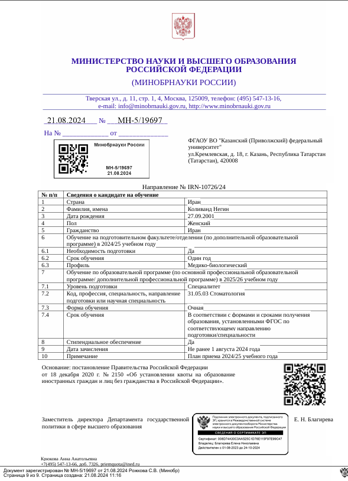
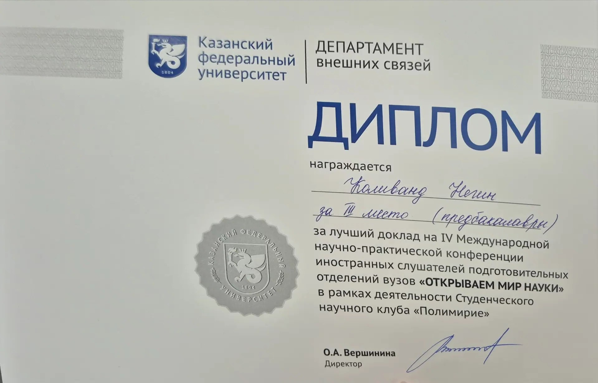
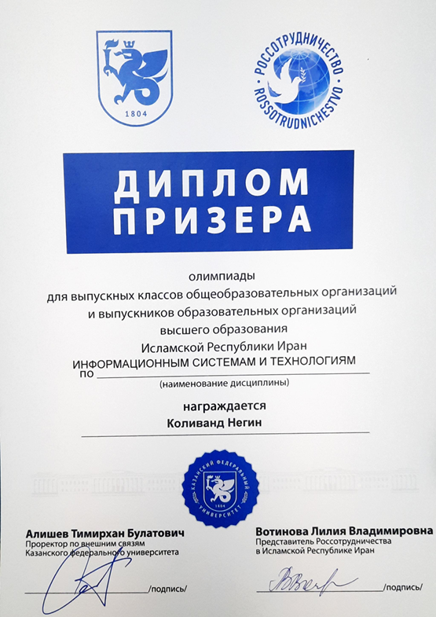
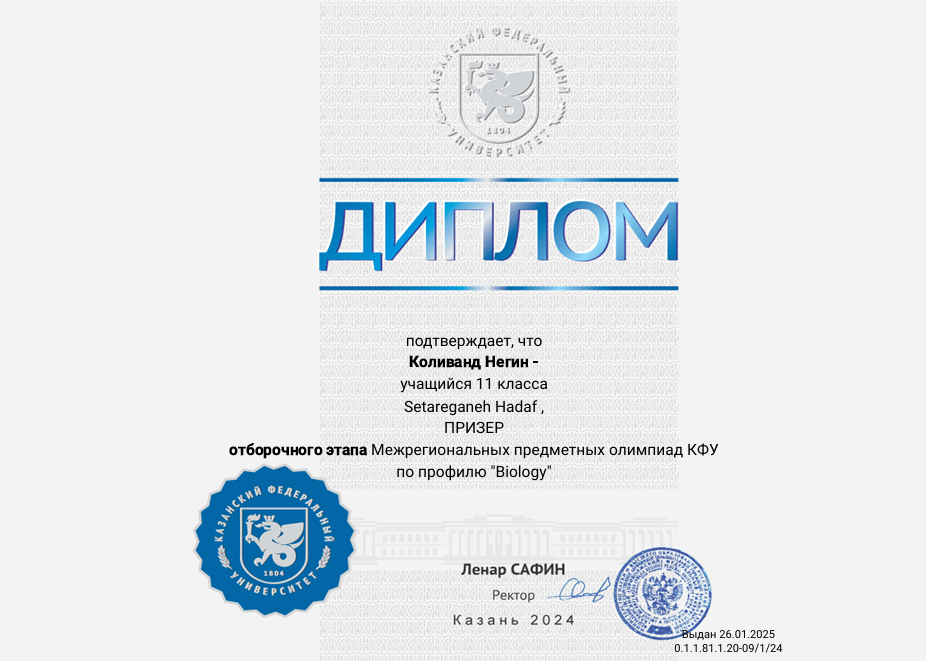
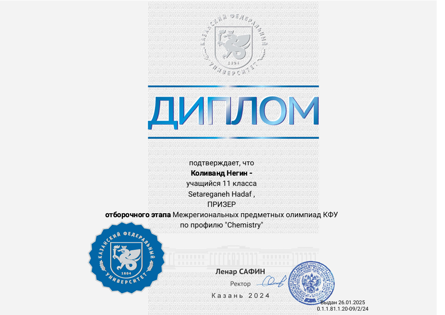
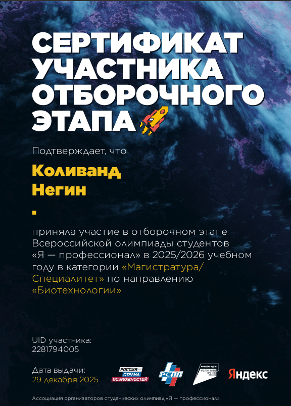
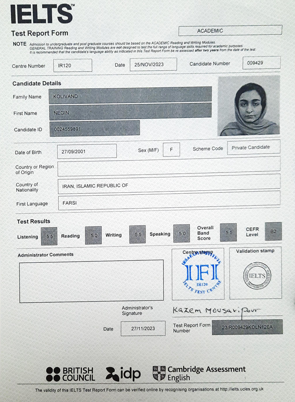
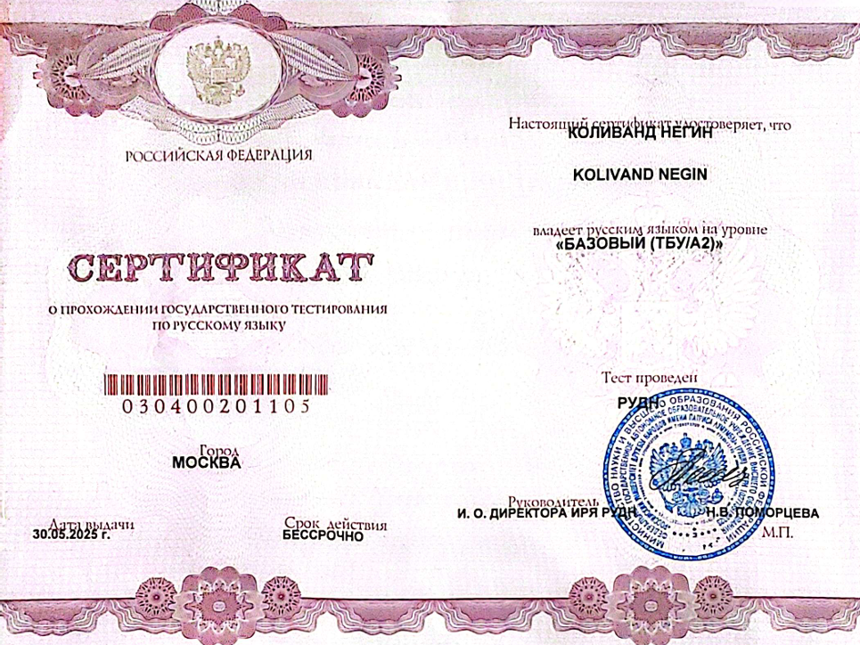

# NEGIN KOLIVAND
**Kazan, Russian Federation** | +7 (927) 034-8129 | [negkolivand@kpfu.ru](mailto:negkolivand@kpfu.ru)
[💼 LinkedIn Profile](https://linkedin.com) | [🌐 Digital Portfolio Hub](https://github.io)

---

## 📄 Professional Summary
A highly accomplished, cross-disciplinary researcher bridging clinical dentistry with technical data intelligence. Recognized as a Russian Government Scholarship recipient, currently pursuing advanced dental studies at Kazan Federal University following top-tier medical and surgical technology training at Shahid Beheshti University of Medical Sciences. A proven high-achiever with an elite academic background within Iran's National Organization for Development of Exceptional Talents (NODET). Combines robust corporate experience as a BI Developer in the financial data mining sector with a record of multiple first-place academic honors, scientific conference victories, and multi-disciplinary subject Olympiads in IT, Chemistry, Biology, and Biotechnology.

---

## 🎓 Education & Scholarships

### 🏛️ Kazan Federal University (KFU) – Kazan, Russian Federation
**Doctor of Dental Medicine (Dentistry)** | *2025 – Present*
* **Russian Government Scholarship:** Awarded a fully funded placement for Dentistry after passing a highly competitive, two-stage national selection process in 2024. Actively maintaining a top-tier academic standing.
 

### 🧪 Kazan Federal University (KFU) – Kazan, Russian Federation
**Russian Language Preparatory Program (Podfak)** | *2024 – 2025*
* Completed intensive academic Russian language training tailored for medical, chemical, and biological disciplines.

### 🏥 Shahid Beheshti University of Medical Sciences (SBMU) – Tehran, Iran
**Bachelor of Science in Surgical Technology** | *2020 – 2024*
* Completed comprehensive clinical and surgical rotation frameworks at a premier, top-ranked public medical university in Iran.

### 🏫 Setaregan-e-Hadaf High School – Tehran, Iran
**High School Diploma in Experimental Sciences** | *Graduated 2020*
* Completed senior graduation year curriculum with top honors.
* **Elite Formative Education (7th – 11th Grade):** Admitted through the highly competitive national entrance examination into the National Organization for Development of Exceptional Talents (**NODET - Farzanegan 4 High School, Tehran**).

---

## 🏅 Honors & Competitive Achievements

### 🥇 1st Place Winner – "Discovering the World of Science" Conference (ОТКРЫВАЕМ МИР НАУКИ)
*Category: Medical Sciences Division (Наука о жизни / Медицинские науки)*
* Awarded top honors for advanced scientific presentation and defense before the university board.
 

### 🥉 3rd Place Winner – "Discovering the World of Science" Conference (ОТКРЫВАЕМ МИР НАУКИ)
*Category: Chemistry Division*
* Recognized for outstanding experimental research presentation and data analysis in the Chemistry track.
 

### 🥇 1st Place Winner – IT Olympiad, Kazan Federal University (KFU)
* Achieved the highest rank in the university's technical information technology and data architecture championship.
 

### 📜 Official Diploma Recipient – Interregional Subject Olympiads of KFU
* Passed advanced Olympic divisions in Chemistry and Biology (**Межрегиональные предметные олимпиады КФУ**).
 
<h4>Biology Division Diploma:</h4>

 
<h4>Chemistry Division Diploma:</h4>

### 🧬 Certified Qualifier – All-Russian Student Olympiad "I am a Professional" (2025/2026)
* Qualified for the highly competitive All-Russian selection stage in the "Biotechnology" category under the Master's/Specialist track (*UID: 2281794005, Dec 2025*).
 

---

## 💼 Professional Experience

### 📊 Tosan Intelligent Data Mining Company – Tehran, Iran
**Business Intelligence (BI) Developer** | *Feb 2023 – Sep 2024*
* Engineered and optimized high-performance data pipelines and enterprise relational database architectures for banking sector analytics.
* Designed corporate BI dashboards to monitor high-volume transactional data streams and isolate analytical anomalies.
* Collaborated on data security compliance routines, bridging software logic with complex database structural requirements.

---

## 🌐 Language Proficiency

### 🇬🇧 English Language (IELTS - B2 Upper-Intermediate)
* Certified proficiency in academic and professional English communication.
 

### 🇷🇺 Russian Language (RUDN University - A2 Certified & KFU Clinical Fluency)
* Official certificate of proficiency in the Russian Language issued by the Peoples' Friendship University of Russia (RUDN), scaled up to clinical fluency through medical residency preparations.
 

---

## 🛠️ Technical Skills Summary
* **Clinical & Research:** Dental Implantology Research, Surgical Technology, Perioperative Workflows, Biotechnology, EHR Data Integrity.
* **Technical & Data:** Business Intelligence (BI), Relational Database Management (SQL), Data Architecture, Analytics, Compliance Auditing.
